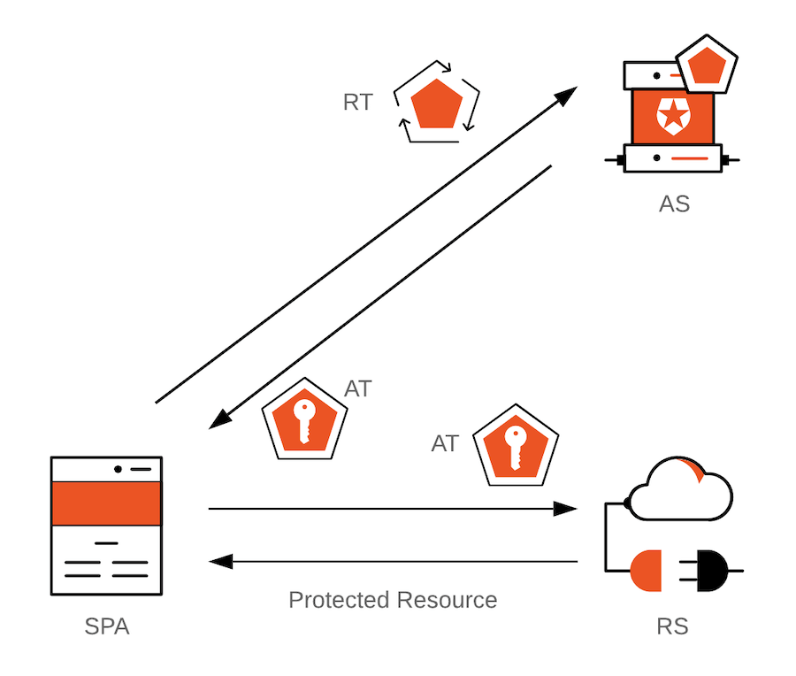
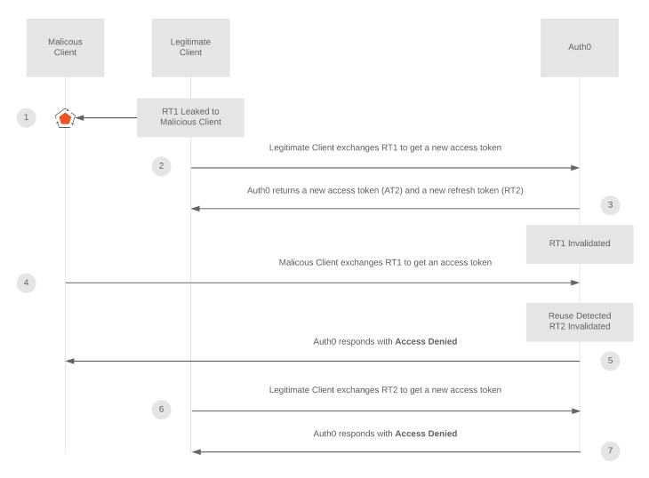
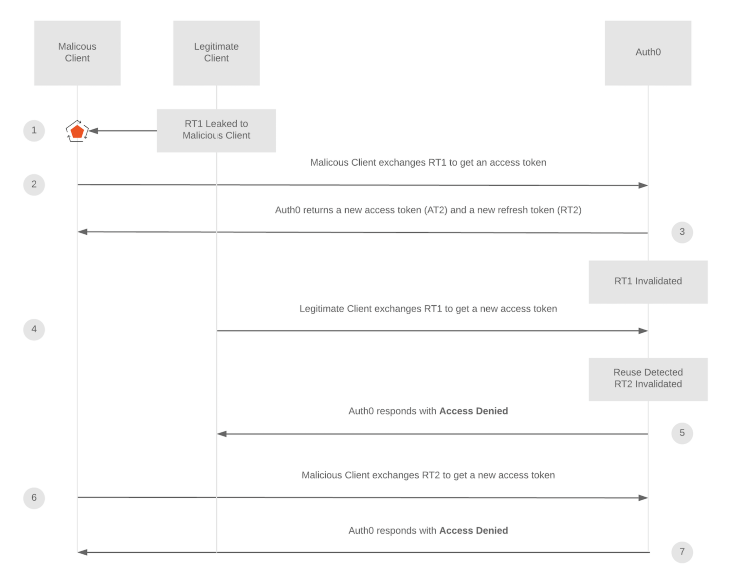

test markdown
When $a \ne 0$, there are two solutions to $(ax^2 + bx + c = 0)$ and they are 
$$ x = {-b \pm \sqrt{b^2-4ac} \over 2a} $$

// in controller
something.controller.ts

// in model
something.model.ts

// in schema
something.schema.ts

// in service
something.service.ts

// in utils
maybe some file : something.utils.ts

//
npx tsc --init

yarn add express zod config cors express mongoose pino pino-pretty dayjs bcrypt jsonwebtoken lodash nanoid

yarn add @types/body-parser @types/config @types/cors @types/express @types/node @types/pino @types/bcrypt @types/jsonwebtoken @types/lodash @types/nanoid ts-node-dev typescript -D

# Authentocation adn Authorization
read:
https://auth0.com/blog/refresh-tokens-what-are-they-and-when-to-use-them/ 
- Token
   are pieces of data that carry just enough information to facilitate the 
   process of determining a user's identity or authorizing a user to perform 
   an action
    
   token example 
   - id token : an artifact that client applications can use to consume the 
   identity of a user. for ex: name, email, profile pict etc.
   - access token (bearer token) : The access token then acts as a 
   credential artifact to access protected resources rather than an 
   identification artifact. Malicious users could theoretically 
   compromise a system and steal access tokens, which in turn they 
   could use to access protected resources by presenting those tokens 
   directly to the server.
   - refresh token : The client application can get a new access token as long as the refresh token is valid and unexpired.
    

# about access tokens and refresh tokens 
links
- https://blog.logrocket.com/persistent-login-in-react-using-refresh-token-rotation/
- https://auth0.com/docs/secure/tokens/refresh-tokens/refresh-token-rotation

## refresh token reuse detection mechanism scenario 1

## refresh token reuse detection mechanism scenario 2

## where to store

# USING CURL

cant use it on wsl2 yet

# WARNING !

- always secure ur private key, cause if someone know ur private key, 
they can generate their own token ONLY ON SERVER SIDE
- public key doesnt need to keep secret :: PUBLIC

So all though 4096 bit, 2048 bit, 1024 bit, or even 512 bit 
looks really strong, but they are too slow to use in our case. 
Imagine you are using 2048 bit key as a secret for our JWT, 
which will be decoded every time a request is sent to maintain the 
user session.

# A LITTLE BIT ABOUT JWT

sources: -https://jwt.io/introduction/

JSON Web Token (JWT) is an open standard (RFC 7519) that defines a 
compact and self-contained way for securely transmitting 
information between parties as a JSON object. This information 
can be verified and trusted because it is digitally signed. JWTs 
can be signed using a secret (with the HMAC algorithm) or a 
public/private key pair using RSA or ECDSA.

## Here are some scenarios where JSON Web Tokens are useful:
- Authorization: This is the most common scenario for using JWT. 
Once the user is logged in, each subsequent request will 
include the JWT, allowing the user to access routes,
services, and resources that are permitted with that 
token. Single Sign On is a feature that widely uses JWT nowadays, 
because of its small overhead and its ability to be easily used 
across different domains.
- Information Exchange: JSON Web Tokens are a good way of securely 
transmitting information between parties. Because JWTs can be 
signed—for example, using public/private key pairs—you can 
be sure the senders are who they say they are. Additionally, 
as the signature is calculated using the header and the payload, 
you can also verify that the content hasn't been tampered with.

## JSON Web Token Structure

- Header
  The header typically consists of two parts: the type of the token, 
  which is JWT, and the signing algorithm being used, such as HMAC SHA256 
  or RSA.
  ex:
  `{
  "alg": "HS256",
  "typ": "JWT"
}`
- Payload
  The second part of the token is the payload, which contains the 
  claims. Claims are statements about an entity (typically, the user) 
  and additional data. There are three types of claims: registered, 
  public, and private claims.

  - Registered claims
    These are a set of predefined claims which are not mandatory but 
    recommended, to provide a set of useful, interoperable claims. 
    Some of them are: iss (issuer), exp (expiration time), 
    sub (subject), aud (audience), and others.
  - Public claims
    These can be defined at will by those using JWTs. 
    But to avoid collisions they should be defined in the IANA 
    JSON Web Token Registry or be defined as a URI that c
    ontains a collision resistant namespace.
  - Private claims
    These are the custom claims created to share information 
    between parties that agree on using them and are neither 
    registered or public claims.

ex :
`{

    "sub": "1234567890",
    "name": "John Doe",
    "admin": true

}`

The payload is then Base64Url encoded to form the second part of the 
JSON Web Token.

# !!!!!!!!!!

Do note that for signed tokens this information, 
though protected against tampering, is readable by anyone. 
Do not put secret information in the payload or header elements 
of a JWT unless it is encrypted.

- Signature
  The signature is used to verify the message wasn't changed along 
  the way, and, in the case of tokens signed with a private key, 
  it can also verify that the sender of the JWT is who it says it is.

